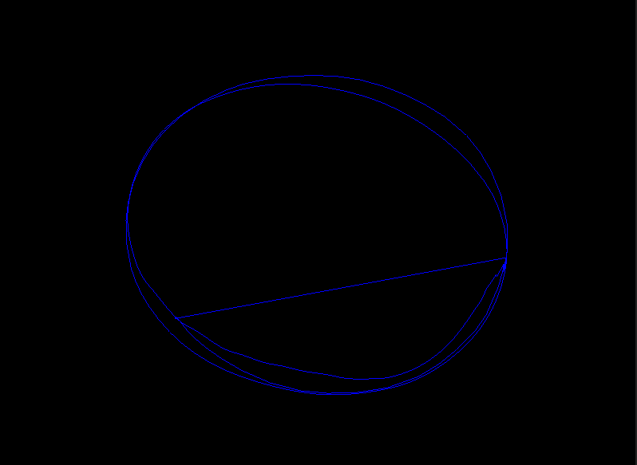
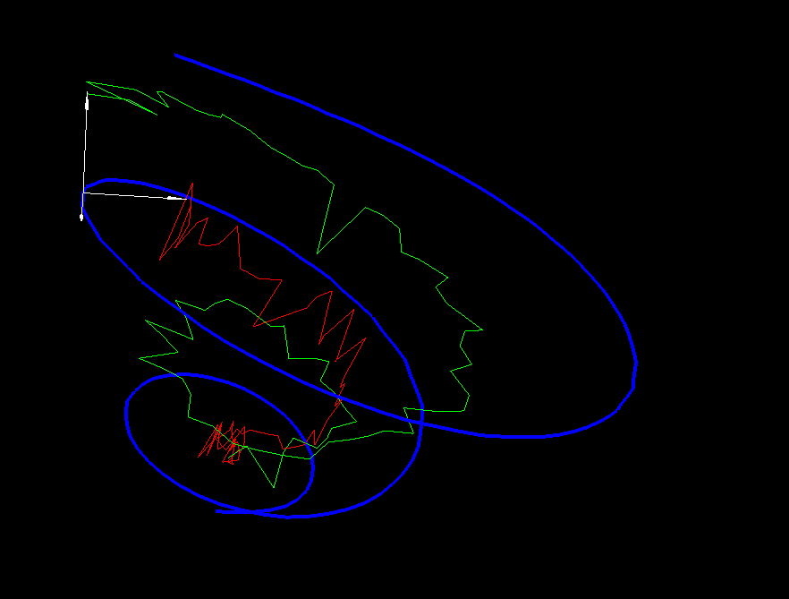

[Live Demo](https://curve-viz-3d.herokuapp.com/5 "demo")






# Install 

## Optional create a virtual env

``` sh
python -m venv venv
source venv/bin/activate
```

## Install requirements
``` sh
pip install -r requirements.txt
```

# Run the app
``` sh
flask run
```

# Setup 

In order to make it works you need to write the code for a few functions:

## load_curve

In =app.py= the function load_curve takes as parameter an =id= and return a 3D curve as 
an iterable of 3-tuples. See examples section for more. 


## Examples

### Matlab files loader 

``` python
  def load_curve(curve_id):
      import scipy.io as sio

      data = sio.loadmat(
          "/path/to/data.mat"
      )
      data = data["curves"]

      return data[:, :, curve_id]
```

### Pathset

``` python
    source = "/path/to/data.pathset"
    curve = []
    with open(source, "r") as f:
        for line in f.readlines():
            try:
                p = [float(x) for x in line.strip().split(" ")]
                assert len(p) == 3
                curve.append(p)
            except:
                pass
    return [curve]
```


